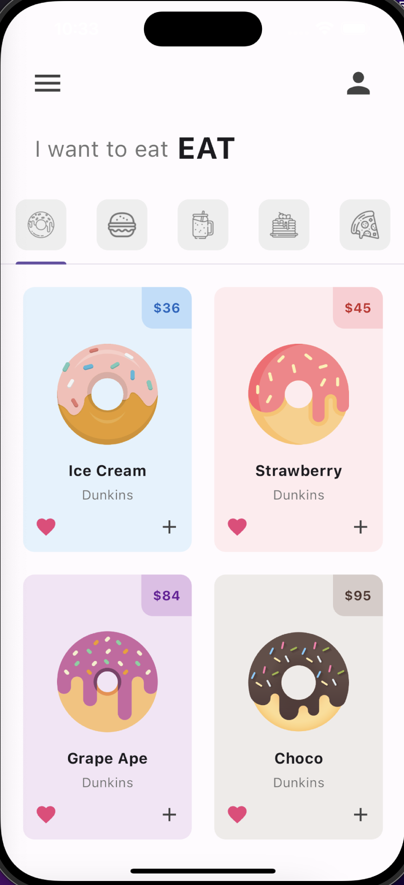

# Donut app

A simple app to demonstrate the use of tabs in flutter.

## Getting Started

To run this app, make sure you have flutter installed and run the following command in the terminal:

```
flutter run
```

## Screenshots


